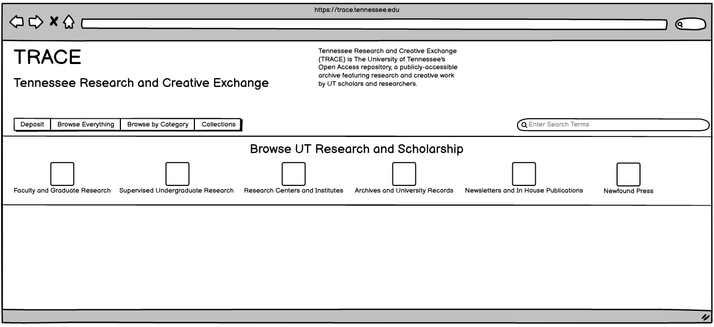

===========================================
Defining Browse and Collection Organization
===========================================

-----
About
-----

This section attempts to make sure we are on the same page about how browse, discovery, and collection organization must
work.

It attempts to implement Rachel's `Trace New Structure <../_static/TRACE_NewStructure_2022.docx>`_ document in Wireframes.

.. important:: View Rachel's `Trace New Structure <../_static/TRACE_NewStructure_2022.docx>`_ document

Note: This is a work in progress and subject to change.

Also, `this document <https://docs.google.com/spreadsheets/d/1AqRHXe8NbcQaWzdtGvVetoX_8N_8VLGthp7D5vYH3sM/edit#gid=0>`_
helps to translate the collections available from our S3 bucket to the Digital Commons frontend.

------------
Initial View
------------

The initial view of Trace should offer users an opportunity to search, browse, and deposit while also displaying
information about the service.

--------------------
Browsing by Category
--------------------

In the new system, it may be desireable to offer alternative forms of navigation beyond structure.

For instance, if a user clicks "Browse Faculty and Graduate Research", we could give them a search results set limited
to that data with the opportunity for the user to further refine.

.. figure:: ../images/faculty_and_grad_new_trace.png
    :scale: 60%
    :alt: Browsing Research in New TRACE

Similarly, limiting to "Newfound Press" would only show those titles, but offer the user to further refine.

.. figure:: ../images/newfound_press_new_trace.png
    :scale: 60%
    :alt: Newfound Press in New TRACE

----------------------------------
Browsing by Structure / Collection
----------------------------------

Nevertheless, users still should be able to navigate by the way things are structured.

One way would simply be to provide a heirarchy of pages that can be navigated.

Another way would be to provide a similar interface where the user can click inside a collection to find more collections
and works.

Regardless of the above, once in the collection a user could be presented information about the collection with links to
individual collections.

Or, the user may be presented a Solr powered response with text about the collection for further refinement.

-----------------
Something to Note
-----------------

Regardless of what we do, we need a machine actionable list of series and the collections that reside inside of them.
This is because there is no metadata in works that state anything beyond what collection it belongs to.  We have :code:`378`
collections, but how many series, communities, or whatever do we have and what should be long to it.