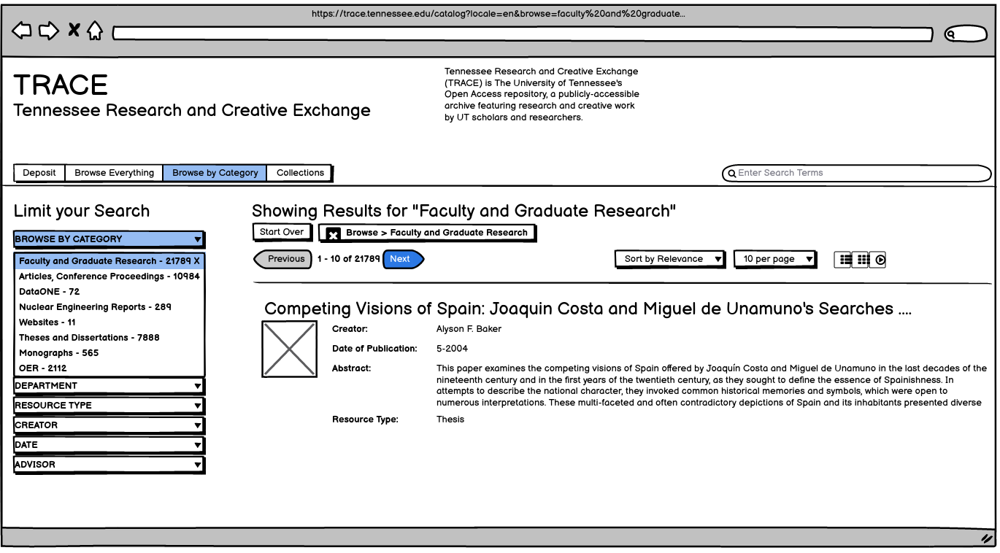
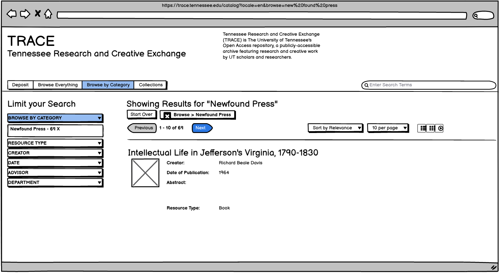

===========================================
Defining Browse and Collection Organization
===========================================

-----
About
-----

This section attempts to make sure we are on the same page about how browse, discovery, and collection organization must
work.

It attempts to implement Rachel's `Trace New Structure <../other_files/TRACE_NewStructure_2022.docx>`_  document in Wireframes.

Note: This is a work in progress and subject to change.

------------
Initial View
------------

The initial view of Trace should offer users an opportunity to search, browse, and deposit while also displaying
information about the service.

.. figure:: ../images/initial_view_future_trace.png
    :scale: 60%
    :alt: Initial View in New TRACE

-----------------
Browsing Research
-----------------

If a user clicks browse by "Faculty and Graduate Research", the results should be limited to just research and give the
user additional opportunities for refine.

--------------
Newfound Press
--------------

Similarly, limiting to "Newfound Press" should only show those titles.

