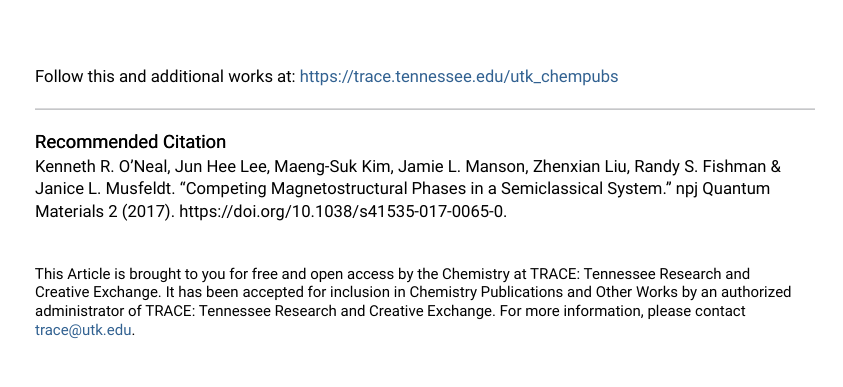
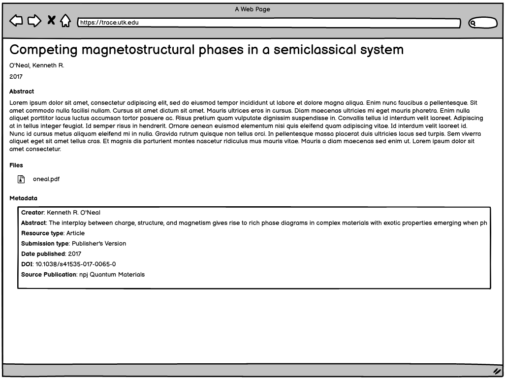

Article
=======

About
-----

This work type represents PDF objects from our Digital Commons instance where the object is a scholarly work like:

* Publisher's version
* Preprint
* Postprint

This work type should capture things that fall in the purview of
`Google Scholar inclusion guidelines <https://scholar.google.com/intl/en/scholar/inclusion.html>`_ only.

How to Identify
---------------

Example
-------

For this example, let's use the contents of :code:`https://trace.tennessee.edu/utk_chempubs/45`:

.. code-block:: text
    metadata.xml
    oneal.pdf
    stamped.pdf

This object includes a descriptive metadata file, the original file uploaded by the author, and a copy of the file with
a cover page.

PCDM Model for Fedora
---------------------

==============
The Whole Work
==============

The object should be a :code:`pcdmworks:Work` and describe its relationship to its files along with its descriptive
metadata elements.

.. code-block:: turtle

    @prefix pcdm: <http://pcdm.org/models#> .
    @prefix pcdmuse: <http://pcdm.org/2015/05/12/use> .
    @prefix pcdmworks: <http://pcdm.org/2016/02/16/works> .

    <http://localhost/sample-scholarly-work> a pcdmworks:Work ;
        <http://purl.org/dc/terms/title> "Competing magnetostructural phases in a semiclassical system" ;
        pcdm:hasFile <http://localhost/sample_article_file_1>, <http://localhost/sample_article_file_2>, <http://localhost/sample_article_file_3> .

==========================
The Original Uploaded File
==========================

The original uploaded file representing this work should be a :code:`pcdmuse:OriginalFile`.

.. code-block:: turtle

    @prefix pcdm: <http://pcdm.org/models#> .
    @prefix pcdmuse: <http://pcdm.org/2015/05/12/use> .
    @prefix pcdmworks: <http://pcdm.org/2016/02/16/works> .

    <http://localhost/sample_article_file_1> a pcdmuse:OriginalFile ;
        rdfs:label "oneal.pdf" ;
        pcdm:fileOf <http://localhost/sample-scholarly-work> .

This file does not need to be publicly accessible.

================
The Stamped File
================

The stamped file has 2 cover pages generated by DigitalCommons. The cover pages are useful for indexing (see
`Monica Westin's Presentation <https://www.carl-abrc.ca/wp-content/uploads/2021/01/Google_Scholar_webinar_Jan2021.pdf>`_
in that it adds things that Google Scholar expects to check against metatags for indexing, but it refers to our current
repository on the first two pages.

If we keep these cover pages, those links could be problematic in the future.  It may be smarter to drop these pages and
add a service to autogenerate the same data on ingest.

**Note**: What should the label be?

.. code-block:: turtle

    @prefix pcdm: <http://pcdm.org/models#> .
    @prefix pcdmuse: <http://pcdm.org/2015/05/12/use> .
    @prefix pcdmworks: <http://pcdm.org/2016/02/16/works> .

    <http://localhost/sample_article_file_2> a pcdmuse:PreservationFile, pcdmuse:IntermediateFile ;
        rdfs:label "stamped.pdf" ;
        pcdm:fileOf <http://localhost/sample-scholarly_work> .

======================
Original Metadata File
======================

We want to keep the original metadata in case there are questions about the migration or something that originally existed
but not appearing in the metadata here.

Ideally, this would not be available to users (at least in the GUI).

.. code-block:: turtle

    @prefix pcdm: <http://pcdm.org/models#> .
    @prefix pcdmuse: <http://pcdm.org/2015/05/12/use> .
    @prefix pcdmworks: <http://pcdm.org/2016/02/16/works> .

    <http://localhost/sample_article_file_3> a pcdm:File ;
        rdfs:label "metadata.xml" ;
        pcdm:fileOf <http://localhost/sample-scholarly-work> .

User Expectations
-----------------

The user should see a thumbnail, the title, and other pertinent metadata defined in our metadata mapping.

Restricted files should be appropriately restricted.

Unrestricted files should be available beneathe the metadata.

Google Scholar
--------------

In order to insure discoverability in Google Scholar, :code:`highwire press meta tags` should be used and a corresponding
cover page should be generated.

.. code-block:: xml

    <meta name="citation_title" content="Competing magnetostructural phases in a semiclassical system">
    <meta name="citation_author" content="O'Neal, Kenneth R.">
    <meta name="citation_author" content="Lee, Jun Hee">
    <meta name="citation_author" content="Kim, Maeng-Suk">
    <meta name="citation_author" content="Manson, Jamie L.">
    <meta name="citation_author" content="Liu, Zhenxian">
    <meta name="citation_author" content="Fishman, Randy S.">
    <meta name="citation_author" content="Musfeldt, Janice L.">
    <meta name="citation_publication_date" content="2017" />
    <meta name="citation_doi" content="10.1038/s41535-017-0065-0">
    <meta name="citation_pdf_url" content="http://our-future-repository.utk.edu/downloads/sample_article_file_2" />
    <meta name="citation_journal_title" content="npj Quantum Materials"/>

Other Things to Think About
---------------------------

======================================
Properly Tagged but Unindexed Articles
======================================

Here is a `article <https://cdr.lib.unc.edu/concern/articles/d217qv80b?locale=en>`_ from UNC's repository. Like other
items of this work type, it has the appropriate :code:`highwire press` metatags:

.. code-block:: xml

    <meta name="citation_title" content="Remdesivir and COVID-19" />
    <meta name="citation_author" content="Edwards, Jessie K." />
    <meta name="citation_author" content="Cole, Stephen R." />
    <meta name="citation_author" content="Adimora, Adaora A." />
    <meta name="citation_publication_date" content="2020" />
    <meta name="citation_pdf_url" content="http://cdr.lib.unc.edu/downloads/1544bw020" />
    <meta name="citation_journal_title" content="The Lancet"/>
    <meta name="citation_volume" content="396"/>
    <meta name="citation_issue" content="10256"/>
    <meta name="citation_firstpage" content="953"/>
    <meta name="citation_lastpage" content=""/>

Interestingly, this version of this work is not in Google Scholar. Most objects of this type from this repostiory are in
Google Scholar. `Mark <https://github.com/markpbaggett>`_ thinks this is likely due to Google Scholar being unable to
confirm the content in the metatags when it reads the PDF.  We should think about this and how it relates to our
repository. See `Monica Westin's presentation <https://www.carl-abrc.ca/wp-content/uploads/2021/01/Google_Scholar_webinar_Jan2021.pdf>`_
for more details.
