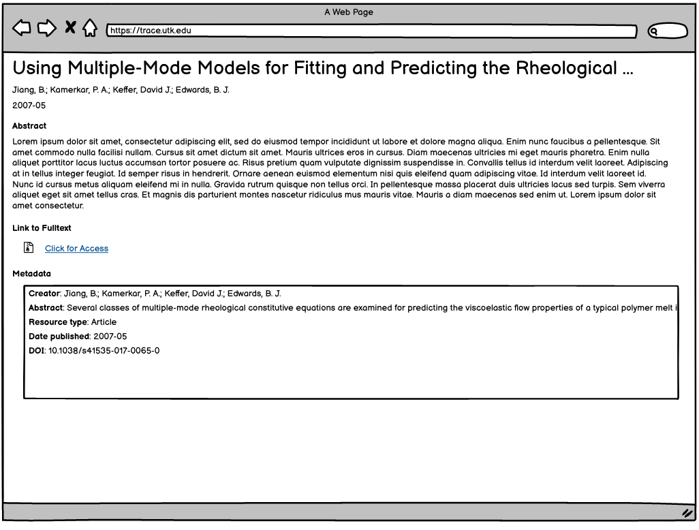

Citation Work Type
==================

About
-----

This work type represents metadata-only objects whose files are not managed in the institutional repository but point to
files elsewhere.

These objects should only ever have descriptive metadata related to the object and pointers to the external object.

Migration Scope
---------------

Current items in Digital Commons with only a :code:`metadata.xml` file that do not point at files at
https://trace.lib.utk.edu.

Suggested Actions
-----------------

1. Only objects with just a metadata.xml file that does not point at https://trace.lib.utk.edu should be this for migration.
2. Do not include metatags that would make these available in Google Scholar.

Example
-------

For this example, let's use the contents of :code:`https://trace.tennessee.edu/utk_chembiopubs/49/`:

.. code-block:: text
    metadata.xml

This object includes only a descriptive metadata file.

**Note**: This points at a broken link, but it works for this example.

Suggested PCDM Model for Fedora
-------------------------------

==============
The Whole Work
==============

I'm not sure how this should work, but this is my best guess. Feedback is welcomed.

.. code-block:: turtle

    @prefix pcdm: <http://pcdm.org/models#> .
    @prefix pcdmuse: <http://pcdm.org/2015/05/12/use> .
    @prefix pcdmworks: <http://pcdm.org/2016/02/16/works> .

    <http://localhost/sample-etd> a pcdmworks:Work ;
        <http://purl.org/dc/terms/title> "Using Multiple-Mode Models for Fitting and Predicting the Rheological Properties of Polymeric Melts. Part II. Single and Double Step- Strain Flows" .

User Expectations
-----------------

The user should see the title and other pertinent metadata defined in our metadata mapping.

A link to the referring file should be included.

