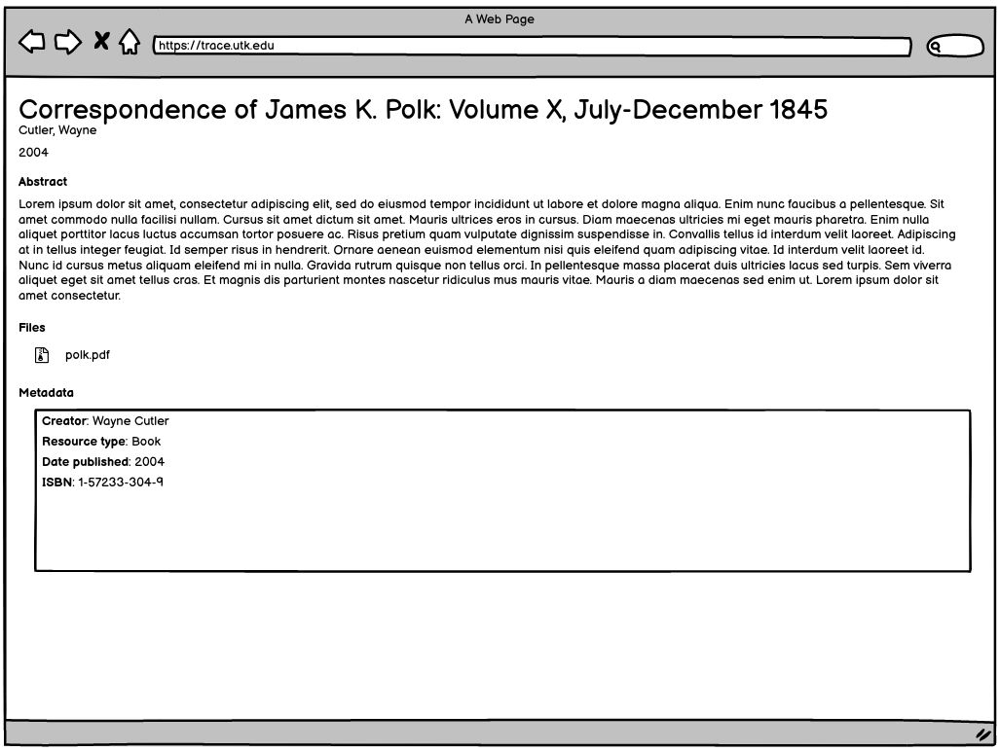

Conference Proceedings Work Type
================================

About
-----

This work type represents conference proceeding.  The object may include additional files including PDFs that are only
portions of the entire object.

This is a separate work type primarily because stakeholders felt that people would not know whether this should go to
book or other.

Migration Scope
---------------

Only PDF like objects whould get this work type and items will be hand selected to get this work type. One specific collection
in scope is:

.. code-block:: text

    utk_sasproceed

Suggested Actions
-----------------

1. Only objects whose primary file type :code:`PDF` should be migrated as this work type.
2. We may need a cover page for these.
3. We will keep all associated supplemental files.
4. We will hand select these for migration.

Example
-------

For this example, let's use the contents of :code:`https://trace.tennessee.edu/utk_sasproceed/8`:

.. code-block:: text

    Ethnocentrism_NFP_30March2021.pdf
    metadata.xml

This object includes a descriptive metadata file and the original file uploaded to the repository.

PCDM Model for Fedora
---------------------

==============
The Whole Work
==============

The object should be a :code:`pcdmworks:Work` and describe its relationship to its files along with its descriptive
metadata elements.

.. code-block:: turtle

    @prefix pcdm: <http://pcdm.org/models#> .
    @prefix pcdmuse: <http://pcdm.org/2015/05/12/use> .
    @prefix pcdmworks: <http://pcdm.org/2016/02/16/works> .
    @prefix : <https://location-of-future-repository/extra/paths/> .

    :sample-conference_proceedings a pcdmworks:Work ;
        <http://purl.org/dc/terms/title> "Ethnocentrism in Its Many Guises" ;
        pcdm:hasFile :sample_conference_proceeding_file_1, :sample_conference_proceeding_file_2 .

==========================
The Original Uploaded File
==========================

The original uploaded file representing this work should be a :code:`pcdmuse:OriginalFile`.

.. code-block:: turtle

    @prefix pcdm: <http://pcdm.org/models#> .
    @prefix pcdmuse: <http://pcdm.org/2015/05/12/use> .
    @prefix pcdmworks: <http://pcdm.org/2016/02/16/works> .
    @prefix : <https://location-of-future-repository/extra/paths/> .

    :sample_conference_proceeding_file_1 a pcdmuse:OriginalFile ;
        rdfs:label "Ethnocentrism_NFP_30March2021.pdf" ;
        pcdm:fileOf :sample-conference-proceedings .

======================
Original Metadata File
======================

We want to keep the original metadata in case there are questions about the migration or something that originally existed
but not appearing in the metadata here.

Ideally, this would not be available to users (at least in the GUI).

.. code-block:: turtle

    @prefix pcdm: <http://pcdm.org/models#> .
    @prefix pcdmuse: <http://pcdm.org/2015/05/12/use> .
    @prefix pcdmworks: <http://pcdm.org/2016/02/16/works> .
    @prefix : <https://location-of-future-repository/extra/paths/> .

    :sample_conference_proceeding_file_2 a pcdm:File ;
        rdfs:label "metadata.xml" ;
        pcdm:fileOf :sample-conference-proceedings .

==================
Supplemental Files
==================

Books can have supplemental files that we want to make available to users.

While this object does not have one, we would model it like this if it did:

.. code-block:: turtle

    @prefix pcdm: <http://pcdm.org/models#> .
    @prefix pcdmuse: <http://pcdm.org/2015/05/12/use> .
    @prefix pcdmworks: <http://pcdm.org/2016/02/16/works> .
    @prefix dcterms: <http://purl.org/dc/terms/> .
    @prefix fabio: <http://purl.org/spar/fabio/> .
    @prefix : <https://location-of-future-repository/extra/paths/> .

    :sample_conference_proceeding_file_3 a pcdmuse:OriginalFile, fabio:SupplementaryInformation  ;
        rdfs:label "Supplemental_File_1.fasta" ;
        dcterms:description "JCVI-CMR Catalase Database (FASTA format)" ;
        dcterms:format "text/plain" ;
        pcdm:fileOf <http://localhost/sample-conference-proceedings> .

User Expectations
-----------------

The user should see the title, files, and other pertinent metadata defined in our metadata mapping.

Restricted files should be appropriately restricted.

Unrestricted files should be available.

Google Scholar Metatags
-----------------------

In order to insure discoverability in Google Scholar as a book, :code:`highwire press meta tags` should be
used and a corresponding cover page should be generated.

.. code-block:: xml

    <meta name="citation_title" content="Correspondence of James K. Polk: Volume X, July-December 1845">
    <meta name="citation_author" content="Cutler, Wayne">
    <meta name="citation_isbn" content="1-57233-304-9">
    <meta name="citation_publisher" content="Newfound Press">
    <meta name="citation_abstract_html_url" content="###Link to the HTML Page the Work Appears On###">
    <meta name="citation_publication_date" content="2004" />
    <meta name="citation_date" content="2004" />
    <meta name="citation_language" content="en_US" />
    <meta name="citation_pdf_url" content="###Link to the PDF###" />

Descriptive Metadata
--------------------

+------------------+------------------+------------------------------------------------+-------------------------------------------------------------------------------------------------------------------------------------------------------------------------+----------+------------+------------+-----------+---------------+------------------------------------------------------------------------------------+-----------+------------------------------------------+
| Name             | Display Label    | Property                                       | Description                                                                                                                                                             | Required | Obligation | Admin only | Facetable | Brief Results | Vocab                                                                              | Syntax    | Metatags                                 |
+==================+==================+================================================+=========================================================================================================================================================================+==========+============+============+===========+===============+====================================================================================+===========+==========================================+
| abstract         | Abstract         | http://purl.org/dc/terms/abstract              | A summary of the resource.                                                                                                                                              | Required | 1-n        | no         | no        | yes           | none                                                                               |           | citation_abstract, dcterms_abstract      |
+------------------+------------------+------------------------------------------------+-------------------------------------------------------------------------------------------------------------------------------------------------------------------------+----------+------------+------------+-----------+---------------+------------------------------------------------------------------------------------+-----------+------------------------------------------+
| author           | Author           | http://id.loc.gov/vocabulary/relators/aut      | The characters that should be displayed after a person's name                                                                                                           | Required | 1-n        | no         | yes       | yes           |                                                                                    |           | citation_author                          |
+------------------+------------------+------------------------------------------------+-------------------------------------------------------------------------------------------------------------------------------------------------------------------------+----------+------------+------------+-----------+---------------+------------------------------------------------------------------------------------+-----------+------------------------------------------+
| buy_link         | Buy this Book    | http://purl.org/cerif/frapo/purchasesFrom      | Link for purchasing the resource                                                                                                                                        | Optional | 0-n        | no         | no        | no            | none                                                                               | URI       |                                          |
+------------------+------------------+------------------------------------------------+-------------------------------------------------------------------------------------------------------------------------------------------------------------------------+----------+------------+------------+-----------+---------------+------------------------------------------------------------------------------------+-----------+------------------------------------------+
| classification   | Classification   | https://dbpedia.org/ontology/classification    | A string representing a class or category the resource is assigned to for browsing purposes                                                                             | Required | 1          | no         | yes       | no            | local                                                                              |           |                                          |
+------------------+------------------+------------------------------------------------+-------------------------------------------------------------------------------------------------------------------------------------------------------------------------+----------+------------+------------+-----------+---------------+------------------------------------------------------------------------------------+-----------+------------------------------------------+
| college          | College          | https://dbpedia.org/ontology/college           | The college associated with the resource's creator.                                                                                                                     | Optional | 0-n        | no         | yes       | no            | local                                                                              |           |                                          |
+------------------+------------------+------------------------------------------------+-------------------------------------------------------------------------------------------------------------------------------------------------------------------------+----------+------------+------------+-----------+---------------+------------------------------------------------------------------------------------+-----------+------------------------------------------+
| discipline       | Discipline       | http://dbpedia.org/ontology/academicDiscipline | A concept that identifies a field of knowledge or human activity defined in a controlled vocabulary, such as Computer Science, Biology, Economics, Cookery or Swimming. | Required | 1-n        | no         | yes       | no            | Bepress vocabulary?                                                                |           | citation_keywords                        |
+------------------+------------------+------------------------------------------------+-------------------------------------------------------------------------------------------------------------------------------------------------------------------------+----------+------------+------------+-----------+---------------+------------------------------------------------------------------------------------+-----------+------------------------------------------+
| doi              | DOI              | http://purl.org/ontology/bibo/doi              | A DOI (Digital Object Identifier), a unique identifier for this resource.                                                                                               | no       | 0-1        | no         | no        | no            |                                                                                    |           | citation_doi                             |
+------------------+------------------+------------------------------------------------+-------------------------------------------------------------------------------------------------------------------------------------------------------------------------+----------+------------+------------+-----------+---------------+------------------------------------------------------------------------------------+-----------+------------------------------------------+
| keywords         | Keyword          | https://w3id.org/idsa/core/keyword             | Keywords that describe the nature, purpose, or use of the content.                                                                                                      | Required | 1-n        | no         | no        | no            | none                                                                               |           | citation_keywords                        |
+------------------+------------------+------------------------------------------------+-------------------------------------------------------------------------------------------------------------------------------------------------------------------------+----------+------------+------------+-----------+---------------+------------------------------------------------------------------------------------+-----------+------------------------------------------+
| notes            | Note             | http://www.w3.org/2004/02/skos/core#note       | A general note, for any purpose.                                                                                                                                        | Optional | 0-n        | no         | no        | no            | none                                                                               |           |                                          |
+------------------+------------------+------------------------------------------------+-------------------------------------------------------------------------------------------------------------------------------------------------------------------------+----------+------------+------------+-----------+---------------+------------------------------------------------------------------------------------+-----------+------------------------------------------+
| orcidID          | Orcid ID         | http://purl.org/cerif/frapo/hasORCID           | An ORCID identifier (not the URL) of a researcher                                                                                                                       | Optional | 0-n        | no         | no        | no            |                                                                                    | ORCID URL | citation_author_orcid                    |
+------------------+------------------+------------------------------------------------+-------------------------------------------------------------------------------------------------------------------------------------------------------------------------+----------+------------+------------+-----------+---------------+------------------------------------------------------------------------------------+-----------+------------------------------------------+
| publication_city | Publication City | http://id.loc.gov/vocabulary/relators/pup      | The place where a resource is published                                                                                                                                 | Required | 1          | no         | no        | no            | geonames                                                                           |           |                                          |
+------------------+------------------+------------------------------------------------+-------------------------------------------------------------------------------------------------------------------------------------------------------------------------+----------+------------+------------+-----------+---------------+------------------------------------------------------------------------------------+-----------+------------------------------------------+
| date_publication | Publication Date | http://purl.org/dc/terms/issued                | Date of formal issuance of the resource.                                                                                                                                | Required | 1          | no         | yes       | no            |                                                                                    | ISO-8601  | citation_date, citation_publication_date |
+------------------+------------------+------------------------------------------------+-------------------------------------------------------------------------------------------------------------------------------------------------------------------------+----------+------------+------------+-----------+---------------+------------------------------------------------------------------------------------+-----------+------------------------------------------+
| publisher        | Publisher        | http://id.loc.gov/vocabulary/relators/pbl      | A person or organization responsible for publishing, releasing, or issuing a resource                                                                                   | Optional | 0-1        | no         | no        | no            | none                                                                               |           | citation_publisher                       |
+------------------+------------------+------------------------------------------------+-------------------------------------------------------------------------------------------------------------------------------------------------------------------------+----------+------------+------------+-----------+---------------+------------------------------------------------------------------------------------+-----------+------------------------------------------+
| resource_type    | Resource Type    | http://purl.org/dc/terms/type                  | The nature or genre of the resource.                                                                                                                                    | Required | 1          | no         | yes       | no            | COAR (https://vocabularies.coar-repositories.org/resource_types/resource_types.nt) |           | dcterms:type                             |
+------------------+------------------+------------------------------------------------+-------------------------------------------------------------------------------------------------------------------------------------------------------------------------+----------+------------+------------+-----------+---------------+------------------------------------------------------------------------------------+-----------+------------------------------------------+
| subject          | Subject          | http://purl.org/dc/terms/subject               | A topic of the resource.                                                                                                                                                | Optional | 0-n        | no         | yes       | no            | FAST                                                                               |           | citation_keywords                        |
+------------------+------------------+------------------------------------------------+-------------------------------------------------------------------------------------------------------------------------------------------------------------------------+----------+------------+------------+-----------+---------------+------------------------------------------------------------------------------------+-----------+------------------------------------------+
| date_submission  | Submission Date  | http://purl.org/dc/terms/dateSubmitted         | Date of submission of the resource.                                                                                                                                     | Required | 1          | no         | no        | no            |                                                                                    | ISO-8601  |                                          |
+------------------+------------------+------------------------------------------------+-------------------------------------------------------------------------------------------------------------------------------------------------------------------------+----------+------------+------------+-----------+---------------+------------------------------------------------------------------------------------+-----------+------------------------------------------+
| title            | Title            | http://purl.org/dc/terms/title                 | A name given to the resource.                                                                                                                                           | Required | 1          | no         | no        | yes           | none                                                                               |           | citation_title                           |
+------------------+------------------+------------------------------------------------+-------------------------------------------------------------------------------------------------------------------------------------------------------------------------+----------+------------+------------+-----------+---------------+------------------------------------------------------------------------------------+-----------+------------------------------------------+
| editor           | Editor           | http://id.loc.gov/vocabulary/relators/edt      |                                                                                                                                                                         | Optional | 0-n        | no         |           |               |                                                                                    |           | citation_editor                          |
+------------------+------------------+------------------------------------------------+-------------------------------------------------------------------------------------------------------------------------------------------------------------------------+----------+------------+------------+-----------+---------------+------------------------------------------------------------------------------------+-----------+------------------------------------------+
| language         | Language         | http://purl.org/dc/terms/language              | The language of the resource.                                                                                                                                           | Optional | 0-n        | no         |           |               |                                                                                    |           | citation_language                        |
+------------------+------------------+------------------------------------------------+-------------------------------------------------------------------------------------------------------------------------------------------------------------------------+----------+------------+------------+-----------+---------------+------------------------------------------------------------------------------------+-----------+------------------------------------------+
| isbn             | ISBN             | http://purl.org/ontology/bibo/isbn             |                                                                                                                                                                         | Required | 1-n        | no         |           |               |                                                                                    |           | citation_isbn                            |
+------------------+------------------+------------------------------------------------+-------------------------------------------------------------------------------------------------------------------------------------------------------------------------+----------+------------+------------+-----------+---------------+------------------------------------------------------------------------------------+-----------+------------------------------------------+
| conference       | Conference       | http://purl.org/ontology/bibo/presentedAt      | The title of the conference where the resource was presented.                                                                                                           | Required | 1          | no         |           |               |                                                                                    |           | citation_conference_title                |
+------------------+------------------+------------------------------------------------+-------------------------------------------------------------------------------------------------------------------------------------------------------------------------+----------+------------+------------+-----------+---------------+------------------------------------------------------------------------------------+-----------+------------------------------------------+
