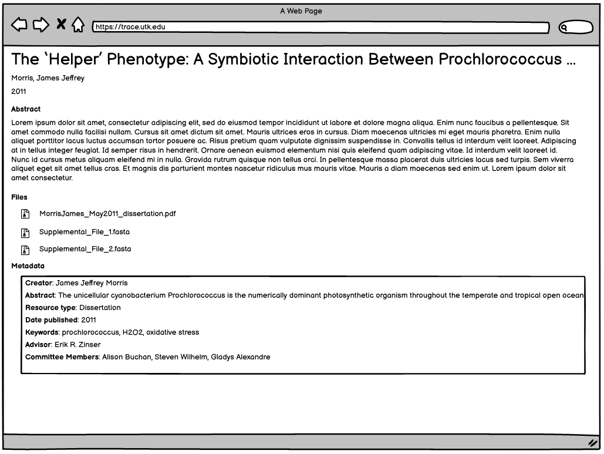

Thesis Work Type
================

About
-----

This work type represents electronic theses and dissertation objects.

These objects should always have:

1. The final file uploaded by the student
2. A file generated by the system with frontmatter from the graduate school
3. Any extra supplemental files that the student has added

Migration Scope
---------------

All objects from these two collections should get this work type.

1. utk_graddiss
2. utk_gradthes

Suggested Actions
-----------------

1. If an object originated as a .doc or .docx, we need the pdf instead for cover page generation.
2. We will provide the vendor for migration pages with front matter but without the coverpage.
3. The vendor will build a feature to add the appropriate cover page.
4. The vendor will build a feature for front matter going forward.

Example Current ETD
-------------------

For this example, let's use the contents of :code:`/trace.tennessee.edu/utk_graddiss/1004`:

.. code-block:: text

    0-Supplemental_File_1.fasta
    1-Supplemental_File_2.fasta
    2-Supplemental_File_3.csv
    3-Supplemental_File_4.csv
    4-Supplemental_File_5.csv
    metadata.xml
    MorrisJames_May2011_dissertation.pdf
    stamped.pdf

In our AWS bucket, we have:

* a descriptive metadata file (metadata.xml)
* the final original uploaded manuscript (MorrisJames_May2011_dissertation.pdf) from the depositor
* a intermediary file with a cover page generated by Digital Commons and a acceptance page from the head of the graduate school.
* supplemental files that the student has provided

The only way to determine which file is the original file submitted by the student is to make sure it is not listed in
the metadata.xml file as a supplemental file.

.. code-block:: xml

    <supplemental-files>
        <file>
            <archive-name>Supplemental_File_1.fasta</archive-name>
            <upload-name>Supplemental_File_1.fasta</upload-name>
            <url>https://trace.tennessee.edu/cgi/viewcontent.cgi?filename=0&amp;amp;article=2048&amp;amp;context=utk_graddiss&amp;amp;type=additional</url>
            <mime-type>text/plain</mime-type>
            <description>JCVI-CMR Catalase Database (FASTA format)</description>
        </file>
        <file>
            <archive-name>Supplemental_File_2.fasta</archive-name>
            <upload-name>Supplemental_File_2.fasta</upload-name>
            <url>https://trace.tennessee.edu/cgi/viewcontent.cgi?filename=1&amp;amp;article=2048&amp;amp;context=utk_graddiss&amp;amp;type=additional</url>
            <mime-type>text/plain</mime-type>
            <description>JCVI-CMR rpsL Database (FASTA format)</description>
        </file>
        <file>
            <archive-name>Supplemental_File_3.csv</archive-name>
            <upload-name>Supplemental_File_3.csv</upload-name>
            <url>https://trace.tennessee.edu/cgi/viewcontent.cgi?filename=2&amp;amp;article=2048&amp;amp;context=utk_graddiss&amp;amp;type=additional</url>
            <mime-type>application/vnd.ms-excel</mime-type>
            <description>Taxonomy of GOS catalase/rpsL hits</description>
        </file>
        <file>
            <archive-name>Supplemental_File_4.csv</archive-name>
            <upload-name>Supplemental_File_4.csv</upload-name>
            <url>https://trace.tennessee.edu/cgi/viewcontent.cgi?filename=3&amp;amp;article=2048&amp;amp;context=utk_graddiss&amp;amp;type=additional</url>
            <mime-type>text/plain</mime-type>
            <description>GOS catalase hits with metadata (CSV format)</description>
        </file>
        <file>
            <archive-name>Supplemental_File_5.csv</archive-name>
            <upload-name>Supplemental_File_5.csv</upload-name>
            <url>https://trace.tennessee.edu/cgi/viewcontent.cgi?filename=4&amp;amp;article=2048&amp;amp;context=utk_graddiss&amp;amp;type=additional</url>
            <mime-type>text/plain</mime-type>
            <description>GOS rpsL hits with metadata (CSV format)</description>
        </file>
    </supplemental-files>

Suggested PCDM Model for Fedora
-------------------------------

Samples are based on current mappings from the `Notch8 mapping doc <https://docs.google.com/spreadsheets/d/1HgVKm6263FBvqMEOoC7VwCeGDtW7u1LjavlmPnA0qiY/edit#gid=0>`_.

An ETD with supplemental files should look like this in Fedora.

==============
The Whole Work
==============

The ETD object should be a :code:`pcdmworks:Work` and describe its relationship to its files along with its descriptive
metadata elements.

In order to get this right, we have to decide whether the original file and stamped pdf is a
:code:`pcdmworks:FileSet` and thus a :code:`pcdm:Object` or simply unrelated :code:`pcdm:File`s.

This is the simplest model where we only have files and no file sets. We have no preference in regards to filesets and
will defer to the vendor for this.

.. code-block:: turtle

    @prefix pcdm: <http://pcdm.org/models#> .
    @prefix pcdmuse: <http://pcdm.org/2015/05/12/use> .
    @prefix pcdmworks: <http://pcdm.org/2016/02/16/works> .

    <http://localhost/sample-etd> a pcdmworks:Work ;
        <http://purl.org/dc/terms/title> "The ‘Helper’ Phenotype: A Symbiotic Interaction Between Prochlorococcus and Hydrogen Peroxide Scavenging Microorganisms" ;
        pcdm:hasFile <http://localhost/etd_file_1>, <http://localhost/etd_file_2>, <http://localhost/etd_file_3>, <http://localhost/etd_file_suppl_1>, <http://localhost/etd_file_suppl_2>, <http://localhost/etd_file_suppl_3>, <http://localhost/etd_file_suppl_4>, <http://localhost/etd_file_suppl_5> .

=========================
The Original Uploaded ETD
=========================

The original ETD should be a :code:`pcdmuse:OriginalFile`.

.. code-block:: turtle

    @prefix pcdm: <http://pcdm.org/models#> .
    @prefix pcdmuse: <http://pcdm.org/2015/05/12/use> .
    @prefix pcdmworks: <http://pcdm.org/2016/02/16/works> .

    <http://localhost/etd_file_1> a pcdmuse:OriginalFile ;
        rdfs:label "MorrisJames_May2011_dissertation.pdf" ;
        pcdm:fileOf <http://localhost/sample-etd> .

This file does not need to be publicly accessible.

================
The Stamped File
================

The stamped file has a cover page generated by DigitalCommons and potentially 2 pages after the initial cover page that
serve as acceptance by the major professor and committee members.

The initial cover page should not be kept, but the other pages that are not in the original file should.

This file should be the one accessed by users in the GUI.

**Note**: What should the label be?

.. code-block:: turtle

    @prefix pcdm: <http://pcdm.org/models#> .
    @prefix pcdmuse: <http://pcdm.org/2015/05/12/use> .
    @prefix pcdmworks: <http://pcdm.org/2016/02/16/works> .

    <http://localhost/etd_file_2> a pcdmuse:PreservationFile, pcdmuse:IntermediateFile ;
        rdfs:label "stamped.pdf" ;
        pcdm:fileOf <http://localhost/sample-etd> .

======================
Original Metadata File
======================

We want to keep the original metadata in case there are questions about the migration or something that originally existed
but not appearing in the metadata here.

Ideally, this would not be available to users (at least in the GUI).

.. code-block:: turtle

    @prefix pcdm: <http://pcdm.org/models#> .
    @prefix pcdmuse: <http://pcdm.org/2015/05/12/use> .
    @prefix pcdmworks: <http://pcdm.org/2016/02/16/works> .

    <http://localhost/etd_file_3> a pcdm:File ;
        rdfs:label "metadata.xml" ;
        pcdm:fileOf <http://localhost/sample-etd> .

==================
Supplemental Files
==================

Some ETDS, like this, have supplemental files that we want to make available to users.

.. code-block:: turtle

    @prefix pcdm: <http://pcdm.org/models#> .
    @prefix pcdmuse: <http://pcdm.org/2015/05/12/use> .
    @prefix pcdmworks: <http://pcdm.org/2016/02/16/works> .
    @prefix dcterms: <http://purl.org/dc/terms/> .
    @prefix fabio: <http://purl.org/spar/fabio/> .

    <http://localhost/etd_file_suppl_1> a pcdmuse:OriginalFile, fabio:SupplementaryInformation  ;
        rdfs:label "Supplemental_File_1.fasta" ;
        dcterms:description "JCVI-CMR Catalase Database (FASTA format)" ;
        dcterms:format "text/plain" ;
        pcdm:fileOf <http://localhost/sample-etd> .

    <http://localhost/etd_file_suppl_2> a pcdmuse:OriginalFile, fabio:SupplementaryInformation ;
        rdfs:label "Supplemental_File_2.fasta" ;
        dcterms:description "JCVI-CMR rpsL Database (FASTA format)" ;
        dcterms:format "text/plain" ;
        pcdm:fileOf <http://localhost/sample-etd> .

    <http://localhost/etd_file_suppl_3> a pcdmuse:OriginalFile, fabio:SupplementaryInformation ;
        rdfs:label "Supplemental_File_3.csv" ;
        dcterms:description "Taxonomy of GOS catalase/rpsL hits" ;
        dcterms:format "application/vnd.ms-excel" ;
        pcdm:fileOf <http://localhost/sample-etd> .

    <http://localhost/etd_file_suppl_4> a pcdmuse:OriginalFile, fabio:SupplementaryInformation ;
        rdfs:label "Supplemental_File_4.csv" ;
        dcterms:description "GOS catalase hits with metadata (CSV format)" ;
        dcterms:format "text/plain" ;
        pcdm:fileOf <http://localhost/sample-etd> .

    <http://localhost/etd_file_suppl_5> a pcdmuse:OriginalFile, fabio:SupplementaryInformation ;
        rdfs:label "Supplemental_File_5.csv" ;
        dcterms:description "GOS rpsL hits with metadata (CSV format)" ;
        dcterms:format "text/plain" ;
        pcdm:fileOf <http://localhost/sample-etd> .

User Expectations
-----------------

The user should see a thumbnail, the title, and other pertinent metadata defined in our metadata mapping.

Restricted files should be appropriately restricted.

Unrestricted files should be available beneathe the metadata.

Google Scholar
--------------

In order to insure discoverability in Google Scholar, :code:`highwire press meta tags` should be used.

Our metadata mapping will include this conversion for this worktype.

.. code-block:: xml

    <meta name="citation_title" content="The ‘Helper’ Phenotype: A Symbiotic Interaction Between Prochlorococcus and Hydrogen Peroxide Scavenging Microorganisms">
    <meta name="citation_authors" content="Morris, James Jeffrey">
    <meta name="citation_date" content="2011">
    <meta name="citation_pdf_url" content="http://our-future-repository.utk.edu/downloads/etd_file_2">

Descriptive Metadata Mapping
----------------------------

+--------------------+--------------------+-----------------------------------------------------+----------------------------------------------------------------------------------------------------------------------------------------------------------------------------------------------------------------------------------------------------------------------------------+----------+------------+------------+-----------+---------------+------------------------------+---------------------------+----------------------------------------------------------------+
| Name               | Display Label      | Property                                            | Description                                                                                                                                                                                                                                                                      | Required | Obligation | Admin only | Facetable | Brief Results | Vocab                        | Syntax                    | Metatags                                                       |
+====================+====================+=====================================================+==================================================================================================================================================================================================================================================================================+==========+============+============+===========+===============+==============================+===========================+================================================================+
| abstract           | Abstract           | http://purl.org/dc/terms/abstract                   | A summary of the resource.                                                                                                                                                                                                                                                       | Required | 1-n        | no         | no        | yes           | none                         |                           | citation_abstract, dcterms.abstract                            |
+--------------------+--------------------+-----------------------------------------------------+----------------------------------------------------------------------------------------------------------------------------------------------------------------------------------------------------------------------------------------------------------------------------------+----------+------------+------------+-----------+---------------+------------------------------+---------------------------+----------------------------------------------------------------+
| additional_advisor | Additional Advisor | http://id.loc.gov/vocabulary/relators/dgs           | A person overseeing a higher level academic degree                                                                                                                                                                                                                               | Optional | 0-n        | no         | no        | no            | none                         |                           |                                                                |
+--------------------+--------------------+-----------------------------------------------------+----------------------------------------------------------------------------------------------------------------------------------------------------------------------------------------------------------------------------------------------------------------------------------+----------+------------+------------+-----------+---------------+------------------------------+---------------------------+----------------------------------------------------------------+
| author             | Author             | http://id.loc.gov/vocabulary/relators/aut           | The characters that should be displayed after a person's name                                                                                                                                                                                                                    | Required | 1-n        | no         | yes       | yes           | none                         |                           | citation_author                                                |
+--------------------+--------------------+-----------------------------------------------------+----------------------------------------------------------------------------------------------------------------------------------------------------------------------------------------------------------------------------------------------------------------------------------+----------+------------+------------+-----------+---------------+------------------------------+---------------------------+----------------------------------------------------------------+
| classification     | Classification     | https://dbpedia.org/ontology/classification         | A string representing a class or category the resource is assigned to for browsing purposes                                                                                                                                                                                      | Required | 1          | no         | yes       | no            | local yml file               |                           |                                                                |
+--------------------+--------------------+-----------------------------------------------------+----------------------------------------------------------------------------------------------------------------------------------------------------------------------------------------------------------------------------------------------------------------------------------+----------+------------+------------+-----------+---------------+------------------------------+---------------------------+----------------------------------------------------------------+
| college            | College            | https://dbpedia.org/ontology/college                | The college associated with the resource's creator.                                                                                                                                                                                                                              | Optional | 0-n        | no         | yes       | no            | local yml file               |                           |                                                                |
+--------------------+--------------------+-----------------------------------------------------+----------------------------------------------------------------------------------------------------------------------------------------------------------------------------------------------------------------------------------------------------------------------------------+----------+------------+------------+-----------+---------------+------------------------------+---------------------------+----------------------------------------------------------------+
| degree_date        | Degree Date        | http://purl.org/cerif/frapo/hasMilestone            | Graduation date                                                                                                                                                                                                                                                                  | Required | 1          | no         | no        | no            | none                         | ISO-8601                  | citation_date                                                  |
+--------------------+--------------------+-----------------------------------------------------+----------------------------------------------------------------------------------------------------------------------------------------------------------------------------------------------------------------------------------------------------------------------------------+----------+------------+------------+-----------+---------------+------------------------------+---------------------------+----------------------------------------------------------------+
| degree_name        | Degree Name        | http://purl.org/ontology/bibo/degree                | Name of the degree                                                                                                                                                                                                                                                               | Required | 1          | no         | yes       | no            | local yml file               |                           |                                                                |
+--------------------+--------------------+-----------------------------------------------------+----------------------------------------------------------------------------------------------------------------------------------------------------------------------------------------------------------------------------------------------------------------------------------+----------+------------+------------+-----------+---------------+------------------------------+---------------------------+----------------------------------------------------------------+
| department         | Department         | http://vivoweb.org/ontology/core#departmentOrSchool | Name of the associated academic department                                                                                                                                                                                                                                       | Required | 1-n        | no         | yes       | no            | local yml file               |                           |                                                                |
+--------------------+--------------------+-----------------------------------------------------+----------------------------------------------------------------------------------------------------------------------------------------------------------------------------------------------------------------------------------------------------------------------------------+----------+------------+------------+-----------+---------------+------------------------------+---------------------------+----------------------------------------------------------------+
| discipline         | Discipline         | http://dbpedia.org/ontology/academicDiscipline      | A concept that identifies a field of knowledge or human activity defined in a controlled vocabulary, such as Computer Science, Biology, Economics, Cookery or Swimming.                                                                                                          | Required | 1-n        | no         | yes       | no            | local yml file               |                           | citation_keywords                                              |
+--------------------+--------------------+-----------------------------------------------------+----------------------------------------------------------------------------------------------------------------------------------------------------------------------------------------------------------------------------------------------------------------------------------+----------+------------+------------+-----------+---------------+------------------------------+---------------------------+----------------------------------------------------------------+
| doi                | DOI                | http://purl.org/ontology/bibo/doi                   | A DOI (Digital Object Identifier), a unique identifier for this resource.                                                                                                                                                                                                        | Optional | 0-1        | no         | no        | no            | none                         | DOI syntax                | citation_doi                                                   |
+--------------------+--------------------+-----------------------------------------------------+----------------------------------------------------------------------------------------------------------------------------------------------------------------------------------------------------------------------------------------------------------------------------------+----------+------------+------------+-----------+---------------+------------------------------+---------------------------+----------------------------------------------------------------+
| date_embargo       | Embargo Date       | http://purl.org/spar/fabio/hasEmbargoDate           | The date before which an entity should not be published, or before which a press release should not be reported on.                                                                                                                                                              | Optional | 0-1        | no         | no        | no            | none                         | ISO-8601                  |                                                                |
+--------------------+--------------------+-----------------------------------------------------+----------------------------------------------------------------------------------------------------------------------------------------------------------------------------------------------------------------------------------------------------------------------------------+----------+------------+------------+-----------+---------------+------------------------------+---------------------------+----------------------------------------------------------------+
| institution        | Institution        | http://id.loc.gov/vocabulary/relators/dgg           | An institution that acts as a host, for example of a project, a resource or a person, for example by providing accommodation, services, operational support and/or funding.                                                                                                      | Required | 1          | yes        | no        | no            | LCNAF                        |                           | citation_dissertation_institution, citation_author_institution |
+--------------------+--------------------+-----------------------------------------------------+----------------------------------------------------------------------------------------------------------------------------------------------------------------------------------------------------------------------------------------------------------------------------------+----------+------------+------------+-----------+---------------+------------------------------+---------------------------+----------------------------------------------------------------+
| keywords           | Keyword            | https://w3id.org/idsa/core/keyword                  | Keywords that describe the nature, purpose, or use of the content.                                                                                                                                                                                                               | Optional | 0-n        | no         | no        | no            | none                         |                           | citation_keywords                                              |
+--------------------+--------------------+-----------------------------------------------------+----------------------------------------------------------------------------------------------------------------------------------------------------------------------------------------------------------------------------------------------------------------------------------+----------+------------+------------+-----------+---------------+------------------------------+---------------------------+----------------------------------------------------------------+
| notes              | Note               | http://www.w3.org/2004/02/skos/core#note            | A general note, for any purpose.                                                                                                                                                                                                                                                 | Optional | 0-n        | no         | no        | no            | none                         |                           |                                                                |
+--------------------+--------------------+-----------------------------------------------------+----------------------------------------------------------------------------------------------------------------------------------------------------------------------------------------------------------------------------------------------------------------------------------+----------+------------+------------+-----------+---------------+------------------------------+---------------------------+----------------------------------------------------------------+
| orcidID            | Orcid ID           | http://purl.org/cerif/frapo/hasORCID                | An ORCID identifier (not the URL) of a researcher                                                                                                                                                                                                                                | Optional | 0-n        | no         | no        | no            | ORCID                        | ORCID URL                 | citation_author_orcid                                          |
+--------------------+--------------------+-----------------------------------------------------+----------------------------------------------------------------------------------------------------------------------------------------------------------------------------------------------------------------------------------------------------------------------------------+----------+------------+------------+-----------+---------------+------------------------------+---------------------------+----------------------------------------------------------------+
| primary_advisor    | Primary Advisor    | http://id.loc.gov/vocabulary/relators/ths           | A person under whose supervision a degree candidate develops and presents a thesis, mémoire, or text of a dissertation                                                                                                                                                           | Required | 1-n        | no         | yes       | no            | ORCID                        |                           |                                                                |
+--------------------+--------------------+-----------------------------------------------------+----------------------------------------------------------------------------------------------------------------------------------------------------------------------------------------------------------------------------------------------------------------------------------+----------+------------+------------+-----------+---------------+------------------------------+---------------------------+----------------------------------------------------------------+
| date_publication   | Publication Date   | http://purl.org/dc/terms/issued                     | Date of formal issuance of the resource.                                                                                                                                                                                                                                         | Required | 1          | no         | yes       | no            | none                         | ISO-8601                  | citation_date, citation_publication_date                       |
+--------------------+--------------------+-----------------------------------------------------+----------------------------------------------------------------------------------------------------------------------------------------------------------------------------------------------------------------------------------------------------------------------------------+----------+------------+------------+-----------+---------------+------------------------------+---------------------------+----------------------------------------------------------------+
| subject            | Subject            | http://purl.org/dc/terms/subject                    | A topic of the resource.                                                                                                                                                                                                                                                         | Optional | 0-n        | no         | yes       | no            | FAST                         |                           | citation_keywords                                              |
+--------------------+--------------------+-----------------------------------------------------+----------------------------------------------------------------------------------------------------------------------------------------------------------------------------------------------------------------------------------------------------------------------------------+----------+------------+------------+-----------+---------------+------------------------------+---------------------------+----------------------------------------------------------------+
| date_submission    | Submission Date    | http://purl.org/dc/terms/dateSubmitted              | Date of submission of the resource.                                                                                                                                                                                                                                              | Required | 1          | no         | no        | no            | none                         | ISO-8601                  |                                                                |
+--------------------+--------------------+-----------------------------------------------------+----------------------------------------------------------------------------------------------------------------------------------------------------------------------------------------------------------------------------------------------------------------------------------+----------+------------+------------+-----------+---------------+------------------------------+---------------------------+----------------------------------------------------------------+
| title              | Title              | http://purl.org/dc/terms/title                      | A name given to the resource.                                                                                                                                                                                                                                                    | Required | 1          | no         | no        | yes           | none                         |                           | citation_title                                                 |
+--------------------+--------------------+-----------------------------------------------------+----------------------------------------------------------------------------------------------------------------------------------------------------------------------------------------------------------------------------------------------------------------------------------+----------+------------+------------+-----------+---------------+------------------------------+---------------------------+----------------------------------------------------------------+
| type               | Type               | http://www.europeana.eu/schemas/edm/hasType         | This property relates a resource with the concepts it belongs to in a suitabletype system such as MIME or any thesaurus that captures categories ofobjects in a given field (e.g., the “Objects” facet in Getty’s Art andArchitecture Thesaurus). It does not capture aboutness. | Required | 1-n        | no         | yes       | no            | no                           |                           |                                                                |
+--------------------+--------------------+-----------------------------------------------------+----------------------------------------------------------------------------------------------------------------------------------------------------------------------------------------------------------------------------------------------------------------------------------+----------+------------+------------+-----------+---------------+------------------------------+---------------------------+----------------------------------------------------------------+
| language           | Language           | http://purl.org/dc/terms/language                   | The language of the resource.                                                                                                                                                                                                                                                    | Optional | 0-n        | no         | no        | no            | local yaml or ISO 639-1 list | ISO 639-1 two-letter code | citation_language                                              |
+--------------------+--------------------+-----------------------------------------------------+----------------------------------------------------------------------------------------------------------------------------------------------------------------------------------------------------------------------------------------------------------------------------------+----------+------------+------------+-----------+---------------+------------------------------+---------------------------+----------------------------------------------------------------+

Other Relevant Approaches in the Wild
-------------------------------------

The Carolina Digital Repository has a `masters thesis <https://cdr.lib.unc.edu/concern/masters_papers/fn1077510?locale=en>`_
that consists of multiple PDFS that appears in Google Scholar.

There are some things to note about it:

1. Only one of the PDFs is significant to Google Scholar.

When you click it, you are sent to that PDF.

This is done with this Highwire Press metatag.

.. code-block:: html

    <meta name="citation_pdf_url" content="http://cdr.lib.unc.edu/downloads/pr76fc68x">

This is a good example for navigating Google Scholar's requirements which having ETDs that consist of multiple files.

