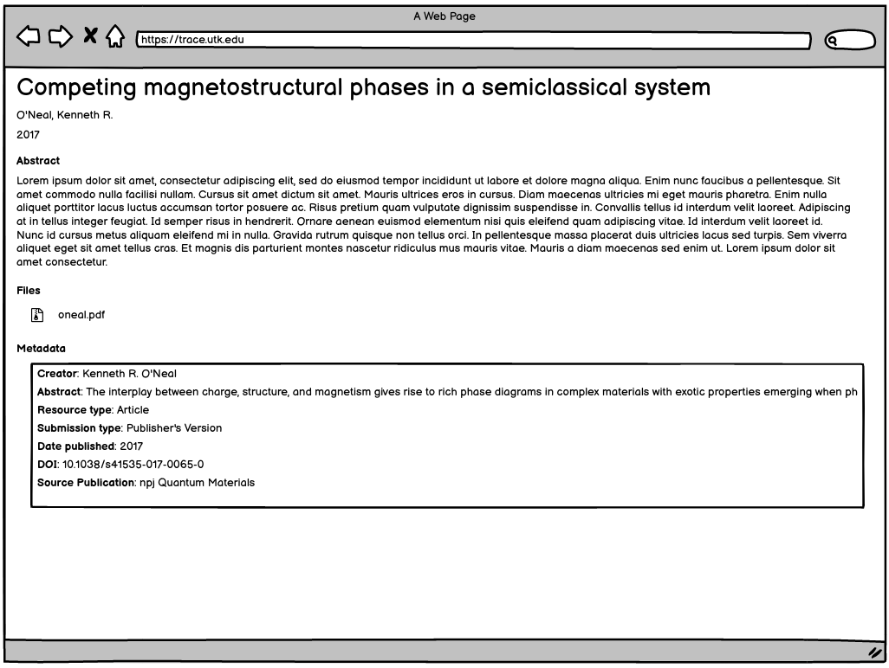

Other Work Type
=================

About
-----

This work type represents objects from our institutional repository that do not belong in Google Scholar.

These objects can have :code:`1-n` files and the primary file can be any extension.

Migration Scope
---------------

Items that are deemed out of scope of Digital Commons will get this worktype.

Suggested Actions
-----------------

1. Since these items are not in scope of Google Scholar, they do not need a cover page.
2. We will migrate all supplemental files mentioned in the metadata.xml.
3. Datasets will be other.
4. Streaming media will be other.

Example
-------

For this example, let's use the contents of :code:`https://trace.tennessee.edu/utk_englpubs/1/`:

.. code-block:: text

    Fishman1_ELProject.pdf
    metadata.xml
    stamped.pdf

This object includes a descriptive metadata file, the original file uploaded by the author, and a copy of the file with
a cover page.

We do not need the stamped file, but will keep the original object, the original metadata, plus any supplemental files.

PCDM Model for Fedora
---------------------

==============
The Whole Work
==============

The object should be a :code:`pcdmworks:Work` and describe its relationship to its files along with its descriptive
metadata elements.

.. code-block:: turtle

    @prefix pcdm: <http://pcdm.org/models#> .
    @prefix pcdmuse: <http://pcdm.org/2015/05/12/use> .
    @prefix pcdmworks: <http://pcdm.org/2016/02/16/works> .

    <http://localhost/sample-other-work> a pcdmworks:Work ;
        <http://purl.org/dc/terms/title> "Form B: Embodied Literacies Project" ;
        pcdm:hasFile <http://localhost/sample_other_file_1>, <http://localhost/sample_other_file_2> .

==========================
The Original Uploaded File
==========================

The original uploaded file representing this work should be a :code:`pcdmuse:OriginalFile`.

.. code-block:: turtle

    @prefix pcdm: <http://pcdm.org/models#> .
    @prefix pcdmuse: <http://pcdm.org/2015/05/12/use> .
    @prefix pcdmworks: <http://pcdm.org/2016/02/16/works> .

    <http://localhost/sample_other_file_1> a pcdmuse:OriginalFile ;
        rdfs:label "Fishman1_ELProject.pdf" ;
        pcdm:fileOf <http://localhost/sample-other-work> .

======================
Original Metadata File
======================

We want to keep the original metadata in case there are questions about the migration or something that originally existed
but not appearing in the metadata here.

Ideally, this would not be available to users (at least in the GUI).

.. code-block:: turtle

    @prefix pcdm: <http://pcdm.org/models#> .
    @prefix pcdmuse: <http://pcdm.org/2015/05/12/use> .
    @prefix pcdmworks: <http://pcdm.org/2016/02/16/works> .

    <http://localhost/sample_other_file_2> a pcdm:File ;
        rdfs:label "metadata.xml" ;
        pcdm:fileOf <http://localhost/sample-other-work> .

User Expectations
-----------------

The user should see a thumbnail, the title, and other pertinent metadata defined in our metadata mapping.

Restricted files should be appropriately restricted.

Unrestricted files should be available beneathe the metadata.

Google Scholar
--------------

These objects should have no metatags and not appear in Google Scholar.

