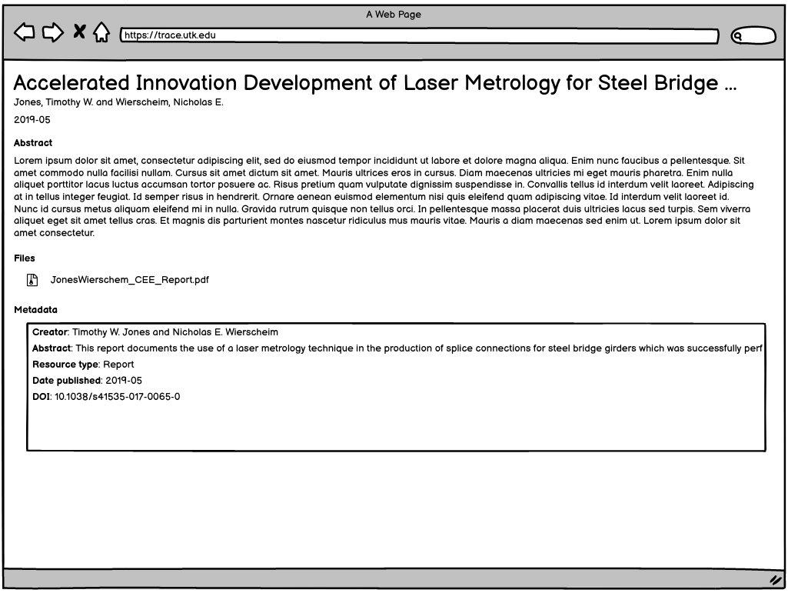

Technical Report Work Type
==========================

About
-----

This work type represents technical report objects in our institutional repository.

Content of this work type should meet the
`Google Scholar inclusion guidelines <https://scholar.google.com/intl/en/scholar/inclusion.html>`_ and be discoverable
in Google Scholar.

These objects should always have:

1. The uploaded work
2. Descriptive metadata
3. Proper metatags for correct Google Scholar Inclusion

Migration Scope
---------------

Items migrated like this will come from select collections.

The primary file type should be a :code:`pdf`.

Suggested Actions
-----------------

1. Only objects whose primary file type :code:`PDF` should be migrated as this work type.
2. We need to generate a cover page for these that match our descriptive metadata.
3. We will only keep supplemental files that are mentioned

Example
-------

For this example, let's use the contents of :code:`https://trace.tennessee.edu/ce_reports/2`:

.. code-block:: text

    0-JonesWierschem_CEE_Report.pdf
    JonesWierschem_CEE_Report.pdf
    metadata.xml
    stamped.pdf

This object includes a descriptive metadata file, the original file uploaded, and a copy of the file with
a cover page.

==============
The Whole Work
==============

The object should be a :code:`pcdmworks:Work` and describe its relationship to its files along with its descriptive
metadata elements.

.. code-block:: turtle

    @prefix pcdm: <http://pcdm.org/models#> .
    @prefix pcdmuse: <http://pcdm.org/2015/05/12/use> .
    @prefix pcdmworks: <http://pcdm.org/2016/02/16/works> .

    <http://localhost/sample-tecnical-report> a pcdmworks:Work ;
        <http://purl.org/dc/terms/title> "Accelerated Innovation Development of Laser Metrology for Steel Bridge ..." ;
        pcdm:hasFile <http://localhost/sample_report_file_1>, <http://localhost/sample_report_file_2>, <http://localhost/sample_report_file_3> .

==========================
The Original Uploaded File
==========================

The original uploaded file representing this work should be a :code:`pcdmuse:OriginalFile`.

.. code-block:: turtle

    @prefix pcdm: <http://pcdm.org/models#> .
    @prefix pcdmuse: <http://pcdm.org/2015/05/12/use> .
    @prefix pcdmworks: <http://pcdm.org/2016/02/16/works> .

    <http://localhost/sample_report_file_1> a pcdmuse:OriginalFile ;
        rdfs:label "JonesWierschem_CEE_Report.pdf" ;
        pcdm:fileOf <http://localhost/sample-technical-report> .

This file does not need to be publicly accessible.

====================
File With Cover Page
====================

There should be a file with a cover page to aid in indexing with Google Scholar with appropriate metadata.

.. code-block:: turtle

    @prefix pcdm: <http://pcdm.org/models#> .
    @prefix pcdmuse: <http://pcdm.org/2015/05/12/use> .
    @prefix pcdmworks: <http://pcdm.org/2016/02/16/works> .

    <http://localhost/sample_report_file_2> a pcdmuse:PreservationFile, pcdmuse:IntermediateFile ;
        rdfs:label "JonesWierschem_CEE_Report.pdf" ;
        pcdm:fileOf <http://localhost/sample-technical_report> .

======================
Original Metadata File
======================

We want to keep the original metadata in case there are questions about the migration or something that originally existed
but not appearing in the metadata here.

Ideally, this would not be available to users (at least in the GUI).

.. code-block:: turtle

    @prefix pcdm: <http://pcdm.org/models#> .
    @prefix pcdmuse: <http://pcdm.org/2015/05/12/use> .
    @prefix pcdmworks: <http://pcdm.org/2016/02/16/works> .

    <http://localhost/sample_report_file_3> a pcdm:File ;
        rdfs:label "metadata.xml" ;
        pcdm:fileOf <http://localhost/sample-technical-report> .

User Expectations
-----------------

The user should see the title, files, and other pertinent metadata defined in our metadata mapping. It should look similar
to an :code:`Article` or other works.

Restricted files should be appropriately restricted.

Unrestricted files should be available.

Google Scholar Metatags
-----------------------

In order to insure discoverability in Google Scholar as a technical report, :code:`highwire press meta tags` should be
used and a corresponding cover page should be generated.

.. code-block:: xml

    <meta name="citation_title" content="Accelerated Innovation Development of Laser Metrology for Steel Bridge Fabrication">
    <meta name="citation_author" content="Jones, Timothy W.">
    <meta name="citation_author" content="Wierscheim, Nicholas E.">
    <meta name="citation_technical_report_institution" content="University of Tennessee">
    <meta name="citation_abstract_html_url" content="###Link to the HTML Page the Work Appears On###">
    <meta name="citation_publication_date" content="2019" />
    <meta name="citation_language" content="en_US" />
    <meta name="citation_pdf_url" content="###Link to the PDF###" />
