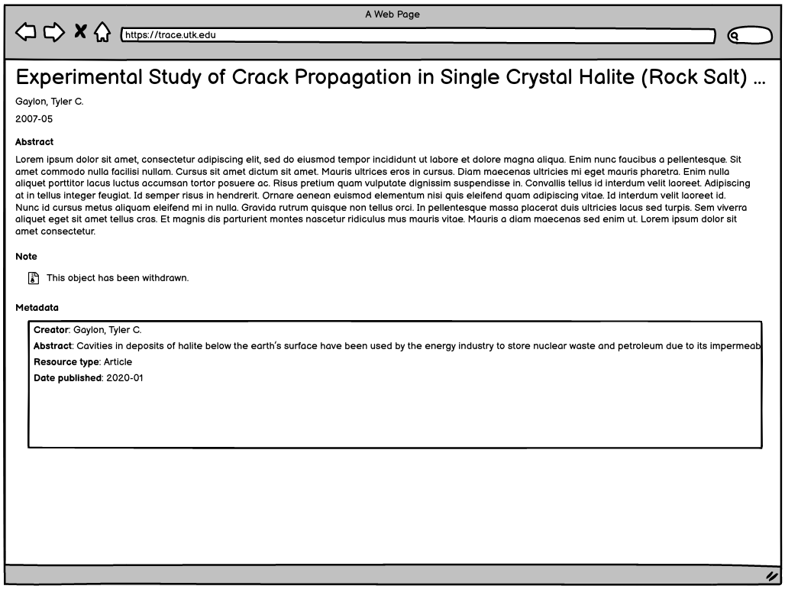

Tombstones and Withdrawn Content
================================

About
-----

We have two use cases for making data unavailable: tombstones and withdrawn content.

What is a Tombstone
-------------------

In cases where a work has been removed, a tombstone should be inserted into the same URI so that anyone who has cited the
object can find out why it has been removed.

Standard practice is:

1. Keep the original metadata for the object that may have been cited.
2. Add a withdrawl statement explaining why the object was removed.
3. Cease making the work itself available.

In "The Institutional Repository: Storing and Sharing Digital Scholarship", Blankenship and Haines write:

.. epigraph::

    Often, a contributor is allowed to withdraw an item; however a marker or "tombstone" indicating the metadata of the withdrawn
    item and the reason for withdrawal will be left in its place. Providing such a marker is important should the withdrawn
    item be cited in another work.

In "CRAFTING AN INSTITUTIONAL REPOSITORY POLICY", Kati writes:

.. epigraph::

    Twenty-five out of the 30 repositories surveyed use tombstones to indicate the removal of
    content, and 23 of those libraries indicate the reason for removal on the tombstone.

User Experience
---------------

Ideally, tombstoned objects would follow best practices by having the original metadata with a reasoning for withdrawal.

