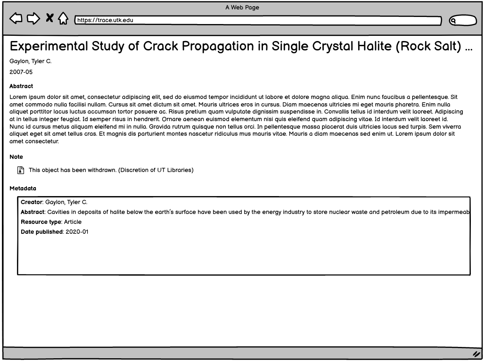

Tombstones and Withdrawn Content
================================

About
-----

We have two use cases for making data unavailable: withdrawal with tombstones and expungement.

What is a Tombstone
-------------------

In cases where a work has been withdrawn, a tombstone should be inserted into the same URI so that anyone who has cited
the object can find out why it has been removed.

Standard practice for tombstoning is to:

1. Keep the original metadata for the object that may have been cited.
2. Add the withdrawal statement explaining why the object was removed.
3. Cease making files related to the work available.

In "The Institutional Repository: Storing and Sharing Digital Scholarship", Blankenship and Haines write:

.. epigraph::

    Often, a contributor is allowed to withdraw an item; however a marker or "tombstone" indicating the metadata of the withdrawn
    item and the reason for withdrawal will be left in its place. Providing such a marker is important should the withdrawn
    item be cited in another work.

In "CRAFTING AN INSTITUTIONAL REPOSITORY POLICY", Kati writes:

.. epigraph::

    Twenty-five out of the 30 repositories surveyed use tombstones to indicate the removal of
    content, and 23 of those libraries indicate the reason for removal on the tombstone.

Use Cases for Tombstoning
-------------------------

When tombstoning an item, one of these rationales should be selected and displayed along with the date of withdrawal:

* Copyright violation
* Plagiarism
* Factual inaccuracies or falsified data
* Legal requirements
* Discretion of the UT Libraries

User Experience
---------------

Ideally, tombstoned objects would follow best practices by having the original metadata with a reasoning for withdrawal.

