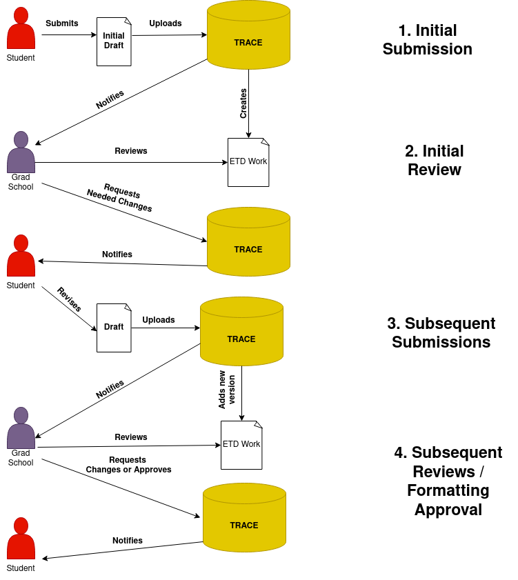
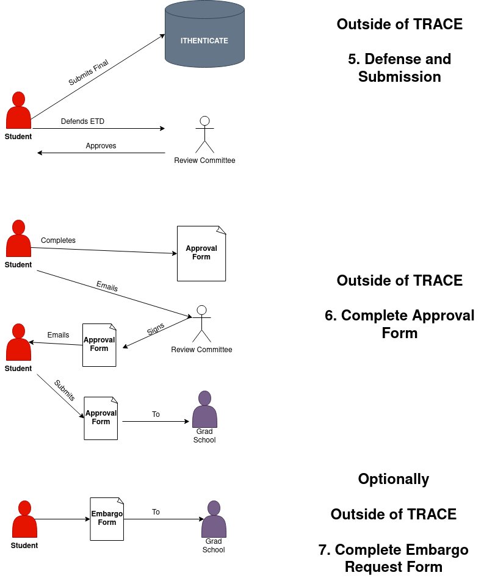
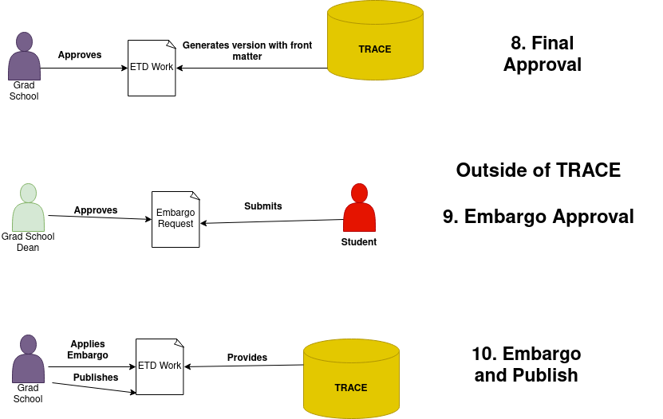

======================================================
Graduate School Workflows for Theses and Dissertations
======================================================

-----
About
-----

This document describes expectations for approval and deposit of electronic theses and dissertations.

------------------------------------
Defining the Current ETD Permissions
------------------------------------

Digital Commons provided us a `spreadsheet <https://docs.google.com/spreadsheets/d/1Co3YdRxkshUrqgIu2dKsnYvL_43HV6FX/edit?usp=sharing&ouid=104017723280373055358&rtpof=true&sd=true>`_
of all unique current permissions in our repository. The spreadsheet describes:

1. The email of the individual who can perform a permission
2. The permission they can perform
3. The series / collection where they can perform it

Our ETDs are split into two series:

1. http://trace.tennessee.edu/utk_graddiss
2. http://trace.tennessee.edu/utk_gradthes

Currently, these emails have permissions in utk_graddis or utk_gradthes:

* smagalla@vols.utk.edu
* sobrien6@vols.utk.edu
* thesis@utk.edu
* ltrott1@utk.edu
* cmccurr4@vols.utk.edu
* vaucoin@vols.utk.edu
* andhcogg@vols.utk.edu
* tkiattik@vols.utk.edu
* kconley3@vols.utk.edu
* asherm10@utk.edu
* jmorg105@utk.edu
* mbagget1@utk.edu
* spica@utk.edu

People listed above have some of these permissions in utk_graddiss and utk_gradthes:

* Is an editor
    * This permission is not explicitly defined by Digital Commons. Is this related to journals? @todo: review journal series for its permissions.
* Batch upload
    * Upload articles in bulk using either Excel or XML
* Receive email notifications
    * Get automatically generated emails and those triggered by administrator/editor actions for the publication.
* Batch revise
    * Generate and download an excel file of a publication’s metadata and make changes in bulk.
* View Configuration tab
    * Access the Configuration page and its subsequent tools.
* Update
    * Update the site to make changes visible on the front end.
* Submit for Authors
    * Access the submission form and upload content on behalf of authors.
* See Reviewers link
    * Access the list of reviewers for a publication and assign reviewers to articles.
* Edit submissions in this publication
    * Access the Manage Submissions screen and its subsequent tools.
* View Digital Commons Dashboard
    * Access the `Digital Commons Dashboard <https://bepress.com/reference_guide_dc/digital-commons-dashboard/>`_ and receive monthly administrator reports.
    * The Digital Commons Dashboard provides a central location for repository administrators and editors to access current download activity, alternative metrics, and usage reports on demand. Whether viewing data for a repository or for specific publications, dashboard tools offer a number of ways to assess and share usage information via four main tabs:
        * Readership: Get a comprehensive picture of where and how users are accessing content geographically, by institution, and over time. The Readership tab is active by default when you first load the dashboard.
        * Usage Reports: Run reports showing downloads, metadata page hits, works posted, or individual works for the content and time frame selected.
        * PlumX: See the full impact of your institution’s content with a variety of article-level insights and alternative metrics.
        * Share the Dashboard: View saved dashboards and share them with stakeholders to demonstrate impact with no login required, and track the number of views.
* Send mailings
    * Send email notifications to a list of subscribers.
* Register Decision
    * Record editorial decisions and send decision emails to authors whether or not content is being peer reviewed.
* Can see all submissions
    * View submissions assigned to all administrators or editors in a publication. Without the permission, administrators/editors only see submissions that have been assigned to them.
* Create volumes, issues, tracks, and themes
    * View links in journals to create new volumes and issues, and links in event communities to create new themes and tracks.
* Create administrators
    * Add other administrators and modify their permissions.
* Edit submissions in this publication
    * Access the Manage Submissions screen and its subsequent tools.
* Select full text download format
    * Choose the most appropriate format for an article, particularly when the article was converted from a native file into a PDF. This permission also allows an administrator to change a submission to metadata-only, saving the file on the back end while removing access to it on the front end.
* Is assigned submissions by default
    * This is a “chief editor” permission whereby new submissions are automatically assigned to the administrator who has this permission. Only a single administrator should be given this permission per publication structure.
* Lock submissions when assigned to this user
    * Submissions assigned to an administrator with this permission will be “Locked,” preventing authors from making any changes until the administrator chooses to unlock the submission.
* Can harvest content from 3rd parties
    * Access and use the `DC Harvesting Tool <https://bepress.com/reference_guide_dc/digital-commons-harvesting-tool/>`_
    * This tool integrates with Scopus, Pure, ORCID, PubMed, and Sherpa-Romeo automates many time-consuming faculty publication workflow steps to populate your IR more comprehensively including:
        * Find all your institution’s works
        * Identify OA content
        * Map and prepopulate high-quality metadata for upload, plus import full-texts from Pure
        * Check for duplicate records already in your IR
        * Check permissions for multiple journals at a time
        * Populating a brand new, or recently migrated IR
        * Standing up faculty publication workflows for the first time
        * Seeking even more efficiency with existing faculty publication workflows
        * Looking to improve departments’ and faculty members’ engagement with the IR
        * Seeking improved ways to support the research enterprise on campus
        * Wanting to identify more open access content to host
        * Wishing to extend content visibility from Pure while avoiding duplication

-------------------------------
Current ETD Submission Workflow
-------------------------------

TRACE, our institutional repository, is the system that is used for managing most of the approval and publication workflow
for ETDS at the University of Tennessee. This workflow includes:

* Allowing the graduate school to review drafts to help the student ensure their ETD is properly formatted according to the `Guide to the Preparation of Theses and Dissertations <https://gradschool.utk.edu/documents/2016/03/guide-to-thesesdissertations.pdf/>`_. Note that these reviews can occur long before thesis defense or publication.
* Serving as the system that allows for ETDs to be uploaded, reviewed, published, and disseminated.
* Allowing the student rights to embargo their ETD when the student has significant concerns related to sensitive or classified information, patents, and potential publishers’ restrictions related to their thesis or dissertation

TRACE is used in conjunction with:

1. Ithenticate
    * Checks for an plagarism issues related to the ETD
2. An `approval form <http://gradschool.utk.edu/documents/2016/02/thesisdissertation-approval.pdf>`_
    * Notifies the graduate school that the work has been fully approved by the committee and it has been run through Ithenticate.
3. An `initial embargo request form <https://gradschool.utk.edu/forms-central/initial-embargo-request/>`_.
    * Includes a reason for the embargo and whether the request is for 1, 3, or 6 years.
4. Outside email
    * Used by the student as a second means of notification that they have submitted an ETD.

Our current ETD submission workflow works like this:

The student can initiate a ETD deposit at any time. Normally this occurs when the student is ready to hear feedback about
how they have formatted their ETD and whether or not their are issues that would need to be addressed even if their is no
issue with the content.  The graduate school states:

.. epigraph::

    All submissions for preliminary review must be sent by the deadline for the term in which the student intends to graduate. However, up to that point, it is essentially never too early to send a draft of a thesis/dissertation for a formatting review.

    The consultant is only reviewing the document for formatting, not content. Formatting includes page sequence, table/figure placement, bibliography, table of contents, abstract, font, margins, etc. Therefore, the more complete it is (formatting-wise), the better. Most first drafts have at least an outline — for example, there might be a page that says “Abstract” although the abstract has not yet been written.

    -- The Graduate School `When to Submit for Review <https://gradschool.utk.edu/thesesdissertations/formatting/>`_

Initial and Subsequent Submissions
==================================

When the student is ready for initial submission, the student:

1. Goes to our current repository and collection and clicks "Submit"
2. Reviews and agrees to the submission agreement **(what does this look like?)**.
3. Popluates descriptive metadata with these required elements:  title, author, date of award (the semester the student graduates), and the degree type (thesis or dissertation).
4. Optionally adds these descriptive metadata elements: an abstract, the major professor, and the committee members.
5. Populates their name according to the UT directory.  The graduate school requires that this value must match what is listed in the `UT Directory <https://directory.utk.edu/>`_.
6. Uploads the full text of the current version of the document.  The graduate school allows this to be PDF or Word. They can also add any supplemental files that they feel relate to their ETD.
7. Clicks submit so that their agreement, metadata, and document is available in the system.
8. Outside of the system, the student then emails the Coordinator of Student Services Confirming that they have submitted a version for review.

The Coordinator of Student Services / Graduate School then:

1. Reviews the student's submission.
2. Notes any issues with the formatting of the submission.
3. Emails the student in the system with any needed changes.

After that, there may be :code:`0-n` subsequent submissions. In these cases, the student:

1. Goes to the series (either theses or dissertations in Trace, clicks the "My Account" link, and finds the original submmision under the “Theses/Dissertations” link.
2. Selects “Revise thesis/dissertation” in the top left corner.
3. On the next page, carefully reviews to ensure that all information is entered accurately, making any updates as needed.
4. Uploads the new version with any changes or additions needed to supplemental files.
5. Provides a reason for the revised draft (incorporated Graduate School feedback, added committee feedback, wrong draft initially submitted, etc.), and click “Submit”.
6. Emails the Coordinator of Student Services outside of system, confirming their submission.

The Coordinator of Student Services / Graduate School then:

1. Reviews the student's submission.
2. Notes any issues with the formatting of the submission.
3. Emails the student in the system with any needed changes.

Defense and Approval Submission
===============================

Before an ETD can be approved, it must be defended. The student:

1. Uploads the completed ETD to Ithenticate to check for plagarism.
2. Defends their ETD with their advisor and committee members.

Once the student defends their ETD, the student must notify the graduate school that the ETD has gone through ITHENTICATE and been defended.

To do this, outside of TRACE the student:

1. Downloads and completes `this form <http://gradschool.utk.edu/documents/2016/02/thesisdissertation-approval.pdf>`_.
2. Ensures the initialed the spaces at the top of the second page.
3. Gets the signatures of their advisor and committee members, using either physical signatures (with a pen) or electronic signatures. To use electronic signatures, email the file to each in turn (do not send to all committee members at the same time). Each then sends the signed file back to the student to send to the next person.
4. Emails the completed form to the graduate school or delivers it in person.

At this time, if the students needs to request an embargo, they do so by:

1. Completing the initial embargo request with their reasoning and the period they are applying for.
2. Emailing the embargo request to the grad school.

Approval, Publish, and Embargo
==============================

The graduate school then:

1. Approves the ETD in TRACE.
2. Adds front matter (**how is this done--is it the approval form, or part of Digital Commons**).

Before publication, the Dean of the Graduate School:

1. Reviews the Initial Embargo requests.
2. Approves or denies.

Finally, the graduate school:

1. Publishes the ETD with the frontmatter.
2. Applies the 1, 3, or 6 year embargo if granted.

-------------------
Future ETD Workflow
-------------------

Ideally, we would like this workflow to be better for our students and the graduate school.  We would like un-published
works to have specific statuses indicating to the "submitter" and "approver" about what needs to happen before the work
goes live.  Each of these statuses are described below and relate to the steps detailed above.

Submitted
=========

This status is reserved for initial submissions by the student to a collection with this workflow.

During this stage, the student will:

1. Initiate a deposit.
2. Agree to terms associated with deposit.
3. Add initial descriptive metadata about the work.
4. Add the PDF version of the object and any associated supplemental files.

On submit, the work should get flagged with a status of :code:`Submitted` and an email should be sent by the student and
the system to the graduate school indicating that it is ready for initial review.

In Progress
===========

The :code:`In Progress` status indicates

Approved and On Hold
====================

Approved and Ready to Publish
=============================

Published
=========

---------------
Other Data Kept
---------------

Any messaging inside of the system is maintained along with dates for approval and publication.